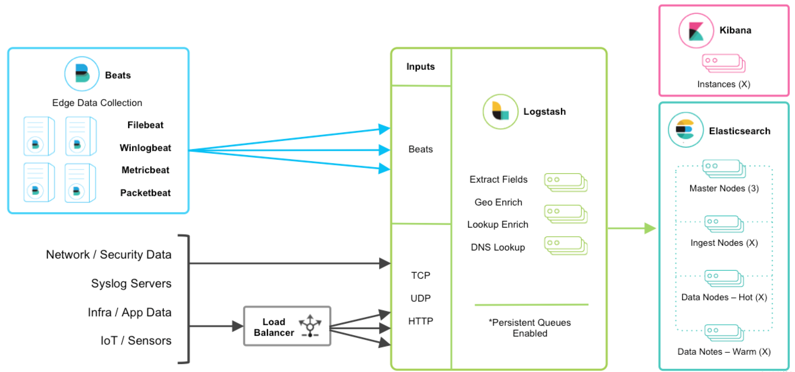

# elk基础概念

## 1.ES简介

1. 是一个高度可扩展的开源全文搜索和分析引擎，它可实现数据的实时全文搜索搜索、支持分布式可实现高可用、提供 API 接口，可以处理大规模日志数据，比如 Nginx、Tomcat、系统日志等功能。
2. Elasticsearch 使用 Java 语言开发，是建立在全文搜索引擎 Apache Lucene 基础之上的搜索引擎，https://lucene.apache.org/。

### 1.2.ES特点和优势

1. **分布式架构**：Elasticsearch 可以在多个节点上运行，这些节点组成一个集群。集群可以横向扩展，以处理大量数据和高并发请求。通过副本（replicas）和分片（shards）机制，Elasticsearch 可以提供高可用性和故障恢复能力。
2. **实时搜索**：Elasticsearch 允许用户在数据索引后几乎立即进行搜索，这使得它非常适合需要实时反馈的应用场景。
3. **RESTful API**：Elasticsearch 提供了基于 HTTP 的 RESTful API，用户可以使用标准的 HTTP 请求来进行索引、搜索和管理操作。这使得与其他系统集成变得更加简单。
4. **数据分析和聚合**：除了搜索功能，Elasticsearch 还具备强大的数据分析能力。用户可以对数据进行聚合，生成统计信息、分组和计算指标。
5. **文档导向**：Elasticsearch 使用 JSON 格式存储数据，数据以文档的形式存储在索引中。这种文档导向的设计使得数据建模更加灵活，适合非结构化和半结构化数据。
6. **与其他工具集成**：支持插件机制，分词插件、同步插件、Hadoop插件等。通常与其他工具（如 Logstash 和 Kibana）结合使用，形成 ELK 堆栈（或 Elastic Stack），用于日志管理、数据分析和可视化。
7. 使用场景：
   - **日志管理**：用于集中存储和搜索应用程序日志、服务器日志等。
   - **网站搜索**：为网站提供高效的搜索功能。
   - **数据分析**：分析用户行为、销售数据等。
   - **监控和警报**：实时监控系统性能并发送警报。

### 1.3.ES基本概念

1. **集群（cluster**）：ES可以作为一个独立的单个搜索服务器。不过，一般为了处理大型数据集，实现容错和高可用性，ES可以运行在许多互相合作的服务器上。这些服务器的集合称为集群。
2. **节点（node）**：运行了单个实例的ES主机称为节点，它是集群的一个成员，可以存储数据、参与集群索引及搜索操作。节点通过为其配置的ES集群名称确定其所要加入的集群。
3. **分片（shard）**：ES的分片(shard)机制可将一个索引内部的数据分布地存储于多个节点，它通过将一个索引切分为多个底层物理的Lucene索引完成索引数据的分割存储功能，这每一个物理的Lucene索引称为一个分片(shard)。
   - 这样的好处是可以把一个大的索引拆分成多个，分布到不同的节点上。降低单服务器的压力，构成分布式搜索，提高整体检索的效率（分片数的最优值与硬件参数和数据量大小有关）。分片的数量只能在索引创建前指定，并且索引创建后不能更改。
4. **副本（replica）**：副本是一个分片的精确复制，每个分片可以有零个或多个副本。副本的作用一是提高系统的容错性，当某个节点某个分片损坏或丢失时可以从副本中恢复。二是提高es的查询效率，es会自动对搜索请求进行负载均衡。

### 1.4.ES的数据架构

1. 索引（index）：ES将数据存储于一个或多个索引中，索引是具有类似特性的文档的集合。类比传统的关系型数据库领域来说，索引相当于SQL中的一个数据库。Elasticsearch可以把索引存放在一台机器或者分散在多台服务器上，每个索引有一或多个分片，每个分片可以有多个副本。
2. 文档（document）：存储在Elasticsearch中的主要实体叫文档（document）。用关系型数据库来类比的话，一个文档相当于数据库表中的一行记录。Elasticsearch和MongoDB中的文档类似，都可以有不同的结构，但Elasticsearch的文档中，相同字段必须有相同类型。文档由多个字段组成，每个字段可能多次出现在一个文档里，这样的字段叫多值字段（multivalued）。每个字段的类型，可以是文本、数值、日期等。字段类型也可以是复杂类型，一个字段包含其他子文档或者数组。在Elasticsearch中，文档以JSON格式进行存储，可以是嵌套的复杂的结构，如：

~~~shell
root@es /root # curl -X POST "http://192.168.1.51:9200/haoke/user/1005" \
-H "Content-Type: application/json" \
-d '{
  "id": 1000000000,
  "name": "张三",
  "age": 37,
  "sex": "男",
  "card": {
    "card_number": "123456789"
  }
}'
~~~

3. 映射（mapping）：映射是定义文档及其包含的字段如何存储和索引的过程。所有文档写进索引之前都会先进行分析，如何将输入的文本分割为词条、哪些词条又会被过滤，这种行为叫做映射（mapping）。一般由用户自己定义规则。

### 1.5.ES与MySQL对比

| MySQL               | elasticsearch         |
| ------------------- | --------------------- |
| database            | index                 |
| table               | type(es8后将弃用)     |
| row                 | document              |
| column              | field                 |
| schema              | mapping               |
| index               | everything is indexed |
| sql                 | query dsl             |
| SELECT * FROM table | GET http://           |
| DATE table SET ……   | PUT http://           |
| group by、avg、sum  | Aggregations          |

>elk专业术语词汇表：
>
>:mag:https://www.elastic.co/guide/en/elastic-stack-glossary/current/terms.html

## 2.Logstash简介

1. Logstash 是一个开源的数据收集和处理工具，通常与 Elasticsearch 和 Kibana 一起使用，形成 ELK 堆栈（或 Elastic Stack）。Logstash 主要用于实时处理、分析和转发日志和事件数据。

### 2.1.Logstash特点和功能

1. **数据收集**：Logstash 支持从多种来源收集数据，包括文件、数据库、消息队列、HTTP、TCP、UDP 等。这使得它可以聚合来自不同系统和服务的数据。
2. **数据处理**：
   - **过滤器**：Logstash 提供了丰富的过滤器插件，可以对数据进行处理和转换，如格式化、解析、字段提取、数据清洗等。常用的过滤器包括 `grok`、`mutate`、`date` 等。
   - **数据增强**：可以根据需要添加元数据或从外部源查询数据，以丰富事件信息。
3. **管道配置**：Logstash 使用配置文件来定义数据的输入、处理和输出流程。用户可以通过编写配置文件灵活地控制数据流动。支持多个管道，可以在一个实例中并行处理多种数据源和处理逻辑。
4. **实时处理**：Logstash 支持实时数据处理，使得用户可以即时获得数据分析和搜索结果，适合用于监控和日志管理场景。
5. 使用场景：
   - **日志管理**：集中收集和处理应用程序、系统和网络设备的日志信息。
   - **监控**：实时监控应用程序和系统的性能，生成报警和报告。
   - **数据集成**：将来自不同来源的数据整合到一个统一的分析平台。
   - **安全分析**：收集和分析安全事件数据，进行入侵检测和安全审计。

## 3.Kibana

### 3.1.Kibana简介

1. Kibana 是一个开源的数据可视化和分析平台，主要用于与 Elasticsearch 一起使用，形成 ELK 堆栈（或 Elastic Stack）。Kibana 提供了强大的用户界面，允许用户对存储在 Elasticsearch 中的数据进行可视化和交互式分析。

### 3.2.Kibana特点和功能

1. 数据可视化：
   - **多种图表类型**：Kibana 支持多种可视化图表，包括柱状图、折线图、饼图、表格、地图等，用户可以根据需求选择合适的可视化方式。
   - **仪表板**：用户可以创建和自定义仪表板，将多个可视化图表组合在一起，提供全面的业务和系统监控视图。
2. 搜索和过滤：
   - **强大的搜索功能**：Kibana 提供了基于 Elasticsearch 的强大搜索能力，用户可以通过简单的查询语法进行复杂的搜索和数据过滤。
   - **时间序列分析**：支持时间范围过滤，方便用户对时间序列数据进行分析，识别趋势和异常。
3. 安全和访问控制：
   - **用户管理**：Kibana 支持用户管理和角色权限控制，确保数据安全和访问控制。
4. 使用场景：
   - **日志分析**：实时监控和分析应用程序和系统日志。
   - **业务智能**：对业务数据进行可视化和分析，以支持决策。
   - **实时数据监控**：可视化实时数据流，便于快速响应和处理。

## 4.Beats

### 4.1.beats简介

1. beats 是一个轻量级的开源数据采集工具，旨在向 Elasticsearch 或 Logstash 发送数据。它是 Elastic Stack 的一部分，主要用于实时收集和转发日志、指标和其他数据。

### 4.2.多种类型的 Beats

1. **Filebeat**：用于收集和转发日志文件的工具，常用于日志管理。
2. **Metricbeat**：用于收集系统和服务的指标数据，如 CPU、内存、磁盘和网络使用情况。
3. **Packetbeat**：用于实时监控网络流量，可以捕获和分析网络数据包。
4. **Winlogbeat**：用于收集 Windows 事件日志。
5. **Auditbeat**：用于监控系统的安全事件和文件完整性。

