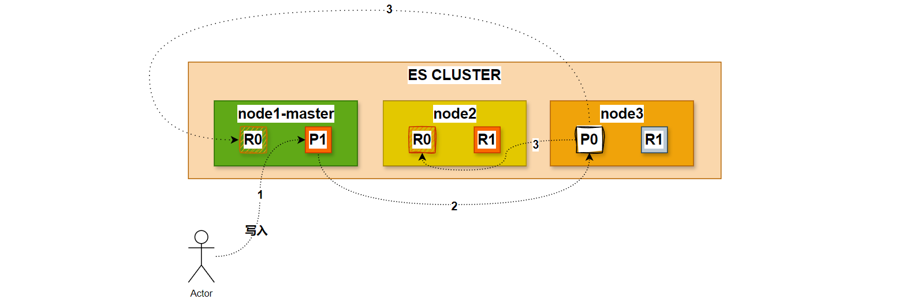

# elasticsearch写入原理

## 1.倒排索引与分词

### 1.1.正排索引

>1. 正排索引就是最普通的索引排序方式。正排索引也是采取key-value pair的方式对数据进行保存，key是doc-id，value则可以存储多种内容，如doc的分词词表、doc所在网页的属性信息等。由此可见，正排索引可以随意添加数据，但如果你要查询某个单词在哪些文档中出现，那么你就不得不将全部文档都遍历一遍，效率极低。
>2. 正排索引指的是文档id到文档内容的映射，也就是将每个文档的内容存储在一个文档ID对应的数据结构中，便于快速地根据文档ID获取文档内容。例如，在关系型数据库中存储的数据，可以看做是一种正排索引的实现。

~~~shell
文档1: {"搜索引擎": [1], "是": [2], "强大": [3], "的": [4], "工具": [5]}
文档2: {"信息检索": [1], "对于": [2], "学术研究": [3], "非常": [4], "重要": [5]}
文档3: {"搜索引擎": [1], "和": [3], "信息检索": [5], "密切": [7], "相关": [9]}
~~~

### 1.2.倒排索引

>1. 倒排索引类似将正排索引反过来，以全部文档中出现的所有words建立一个词典（term dictionary ），然后对于term dictionary 中的每个词，它后面都会跟随一个链表，该链表就是倒排表 ，倒排表内存储着如下信息：
>   - 该词出现的doc-id
>   - 该词在某doc中的出现次数和出现位置
>2. 如此一来，倒排索引就可以在用户输入查询query时，将query分词成一个个token，然后将一个个token带到term dictionary 去“查字典”，然后获得出现该词的doc-id集合，最终在这若干个token对应的若干doc-id集合上做交集，得到最符合用户query查询的结果。由此可见，倒排索引大大加快了查询速度，然而一旦有新的文档加入文档库，你就要重新做一次"入库操作"，即建立倒排索引的操作。因为此时各个token在不同文档中的出现次数、以及每个token对应的 倒排表 都可能发生变化。

~~~shell
"搜索引擎": [1, 3]
"是": [1]
"强大": [1]
"的": [1]
"工具": [1]
"信息检索": [2, 3]
"对于": [2]
"学术研究": [2]
"非常": [2]
"重要": [2]
"和": [3]
"密切": [3]
"相关": [3]
~~~

在ES中，每个文档都被存储为一个JSON格式的文档，每个文档都有一个唯一的ID。ES使用倒排索引来存储每个词项出现的文档ID，以及每个文档中每个词项的出现位置等信息。这使得ES能够高效的搜索和查询文档。

>具体的例子：Hello world,this is a sample document 可以转化成如下的正排索引

~~~shell
document_id | position | term
------------|----------|-------
1           | 1        | Hello
1           | 2        | world
1           | 3        | this
1           | 4        | is
1           | 5        | a
1           | 6        | sample
1           | 7        | document
~~~

>可以看到，这个正排索引存储了文档ID、单词位置和单词本身。如果我们要查找包含单词document的文档，我们可以根据这个索引快速找到该单词所在的位置，并获取对应的文档ID
>
>
>
>相比之下，倒排索引存储了每个单词出现在哪些文档中，即存储了单词->文档ID的键值对，举个例子
>
>Document 1: Hello world, this is a sample document.
>
>Document 2: The quick brown fox jumps over the lazy dog.
>
>Document 3: The sky is blue, the grass is green.
>
>可以转化成如下的倒排索引

~~~shell
term     | document_ids
---------|-------------
Hello    | 1
world    | 1
this     | 1
is       | 1
a        | 1
sample   | 1
document | 1
The      | 2, 3
quick    | 2
brown    | 2
fox      | 2
jumps    | 2
over     | 2
the      | 2, 3
lazy     | 2
dog      | 2
sky      | 3
is       | 3
blue     | 3
grass    | 3
green    | 3
~~~

>可以看到，这个倒排索引存储了每个单词出现的文档ID，如果我们要查找包含单词document的文档，可以快速找到包含该单词的文档ID

## 2.写索引原理

### 2.1.数据复制模型

>Elasticsearch 中的每个索引都被划分为shard，每个shard 可以有多个副本，这些副本称为副本组，在添加或删除文档时必须保持同步。

### 2.2. 路由（routing）

>1. 在ELasticsearch中，会采用计算的方式来确定存储到哪个节点，计算公式如下：
>   - shard = hash(routing) % number_1 of_primary_shards
>     - routing值是一个任意字符串，它默认是_id但也可以自定义。
>     - 这个routing字符串通过哈希函数生成一个数字，然后除以主切片的数量得到一个余数(remainder)，余数的范围永远是0到number_of_primary_shards - 1，这个数字就是特定文档所在的分片。
>2. 这就是为什么创建了主分片后，不能修改的原因。因为如果数量变化了，那么所有之前路由的值都会无效，文档也再也找不到了。写入过程

### 2.3.写入过程

>1. 新建、索引和删除请求都是写(write)操作，它们必须在主分片上成功完成才能复制到相关的复制分片上。

>2. 在主分片和复制分片上成功新建、索引或删除一个文档必要的顺序步骤：
>   - 客户端给Node 1 发送新建、索引或删除请求。
>   - 节点使用文档的_id 确定文档属于分片0 。它转发请求到Node 3 ，分片0 位于这个节点上。
>   - Node 3 在主分片上执行请求，如果成功，它转发请求到相应的位于Node 1 和Node 2 的复制节点上。当所有的复制节点报告成功， Node 3 报告成功到请求的节点，请求的节点再报告给客户端。
>   - 客户端接收到成功响应的时候，文档的修改已经被应用于主分片和所有的复制分片。

## 3.存储原理

### 3.1.分段存储（segment）

1. 索引文档以段的形式存储在磁盘上，何为段？索引文件被拆分为多个子文件，则每个子文件叫作段，每一个段本身都是一个倒排索引，并且段具有不变性，一旦索引的数据被写入硬盘，就不可再修改。
   - 在 Elasticsearch 中，**段（Segment）** 是一种基本的存储单位，是 Lucene 中的核心概念。每个分片由多个段组成
2. 在底层采用了分段的存储模式，使它在读写时几乎完全避免了锁的出现，大大提升了读写性能。
3. 段被写入到磁盘后会生成一个提交点，提交点是一个用来记录所有提交后段信息的文件。
4. 一个段一旦拥有了提交点，就说明这个段只有读的权限，失去了写的权限。相反，当段在内存中时，就只有写的权限，而不具备读数据的权限，意味着不能被检索。
5. 段的概念提出主要是因为：在早期全文检索中为整个文档集合建立了一个很大的倒排索引，并将其写入磁盘中。
6. 如果索引有更新，就需要重新全量创建一个索引来替换原来的索引。这种方式在数据量很大时效率很低，并且由于创建一次索引的成本很高，所以对数据的更新不能过于频繁，也就不能保证时效性。

>1. 索引文件分段存储并且不可修改，那么新增、更新和删除如何处理呢？
>   - 新增，新增很好处理，由于数据是新的，所以只需要对当前文档新增一个段就可以了。
>   - 删除，由于不可修改，所以对于删除操作，不会把文档从旧的段中移除而是通过新增一个 .del 文件，文件中会列出这些被删除文档的段信息。这个被标记删除的文档仍然可以被查询匹配到， 但它会在最终结果被返回前从结果集中移除。
>   - 更新，不能修改旧的段来进行反映文档的更新，其实更新相当于是删除和新增这两个动作组成。会将旧的文档在 .del 文件中标记删除，然后文档的新版本被索引到一个新的段中。可能两个版本的文档都会被一个查询匹配到，但被删除的那个旧版本文档在结果集返回前就会被移除。
>2. 段被设定为不可修改具有一定的优势也有一定的缺点，优势主要表现在：
>   - 不需要锁。如果你从来不更新索引，不需要担心多进程同时修改数据的问题。
>   - 一旦索引被读入内核的文件系统缓存，便会留在哪里，由于其不变性。只要文件系统缓存中还有足够的空间，那么大部分读请求会直接请求内存，而不会命中磁盘。这提供了很大的性能提升。
>   - 其它缓存(像 Filter 缓存)，在索引的生命周期内始终有效。它们不需要在每次数据改变时被重建，因为数据不会变化。
>   - 写入单个大的倒排索引允许数据被压缩，减少磁盘 I/O 和需要被缓存到内存的索引的使用量。
>3. 段的不变性的缺点如下：
>   - 当对旧数据进行删除时，旧数据不会马上被删除，而是在 .del 文件中被标记为删除。而旧数据只能等到段更新时才能被移除，这样会造成大量的空间浪费。
>   - 若有一条数据频繁的更新，每次更新都是新增新的标记旧的，则会有大量的空间浪费。
>   - 每次新增数据时都需要新增一个段来存储数据。当段的数量太多时，对服务器的资源例如文件句柄的消耗会非常大。
>   - 在查询的结果中包含所有的结果集，需要排除被标记删除的旧数据，这增加了查询的负担。

### 3.2.延迟写入（refresh）

1. 如果是数据直接写入到磁盘上，磁盘的 I/O 消耗上会严重影响性能。那么当写数据量大的时候会造成 ES 停顿卡死，查询也无法做到快速响应。为了提升写的性能，ES 并没有每新增一条数据就增加一个段到磁盘上，而是采用**延迟写的策略**。
2. 每当有新增的数据时，就将其先写入到内存中，在内存和磁盘之间是文件系统缓存。当达到默认的时间（1 秒钟）或者内存的数据达到一定量时，会触发一次刷新（Refresh），将内存中的数据生成到一个新的段上并缓存到文件缓存系统 上，稍后再被刷新到磁盘中并生成提交点。这里的内存使用的是 ES 的 JVM 内存，而文件缓存系统使用的是操作系统的内存。新的数据会继续的被写入内存，但内存中的数据并不是以段的形式存储的，因此不能提供检索功能。
3. 由内存刷新到文件缓存系统的时候会生成新的段，并将段打开以供搜索使用，而不需要等到被刷新到磁盘。在 Elasticsearch 中，写入和打开一个新段的轻量的过程叫做 Refresh （**即内存刷新到文件缓存系统**）。
4. 默认情况下每个分片会每秒自动刷新一次。这就是为什么我们说 Elasticsearch 是近实时搜索，因为文档的变化并不是立即对搜索可见，但会在一秒之内变为可见。我们也可以手动触发 Refresh，POST /_refresh 刷新所有索引，POST /nba/_refresh 刷新指定的索引。

>:bell:
>
>1. 尽管刷新是比提交轻量很多的操作，它还是会有性能开销。当写测试的时候， 手动刷新很有用，但是不要在生产环境下每次索引一个文档都去手动刷新。而且并不是所有的情况都需要每秒刷新。
>2. 可能你正在使用 Elasticsearch 索引大量的日志文件， 你想优化索引速度而不是近实时搜索。这时可以在创建索引时在 Settings 中通过调大 refresh_interval = “30s” 的值 ， 降低每个索引的刷新频率，设值时需要注意后面带上时间单位，否则默认是毫秒。当 refresh_interval=-1 时表示关闭索引的自动刷新。

### 3.3.事务日志（Translog）

### 3.4.段合并（flush）

