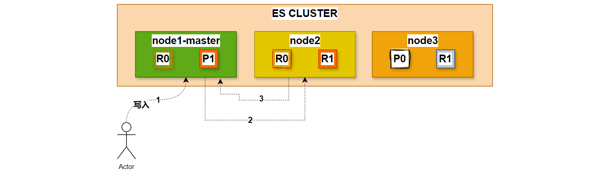

# ES检索原理

## 1.搜索文档（单个文档）

>1. 文档能够从主分片或任意一个复制分片被检索。

>2. 在主分片或复制分片上检索一个文档必要的顺序步骤：
>   - 客户端给Node 1 发送get请求。
>   - 节点使用文档的_id 确定文档属于分片0 。分片0 对应的复制分片在三个节点上都有。此时，它转发请求到Node 2 。
>   - Node 2 返回文档(document)给Node 1 然后返回给客户端。
>3. 对于读请求，为了平衡负载，请求节点会为每个请求选择不同的分片——它会循环所有分片副本。
>4. 可能的情况是，一个被索引的文档已经存在于主分片上却还没来得及同步到复制分片上。这时复制分片会报告文档未找到，主分片会成功返回文档。一旦索引请求成功返回给用户，文档则在主分片和复制分片都是可用的。

## 2.全文搜索

搜索，分为2个阶段，搜索（query）+取回（fetch）。

### 2.1.搜索（query）

>1. 查询阶段包含以下三步：
>   - 客户端发送一个search（搜索） 请求给Node 3 ,Node 3 创建了一个长度为from+size 的空优先级队
>   - Node3转发这个搜索请求到索引中每个分片的原本或副本。每个分片在本地执行这个查询并且结果将结果到一个大小为from+size 的有序本地优先队列里去。
>   - 每个分片返回document的ID和它优先队列里的所有document的排序值给协调节点Node3 。Node3 把这些值合并到自己的优先队列里产生全局排序结果。

### 2.2.取回（fetch）

>1. 分发阶段由以下步骤构成：
>   - 协调节点辨别出哪个document需要取回，并且向相关分片发出GET请求。
>   - 每个分片加载document并且根据需要丰富（enrich）它们，然后再将document返回协调节点。
>   - 一旦所有的document都被取回，协调节点会将结果返回给客户端。

