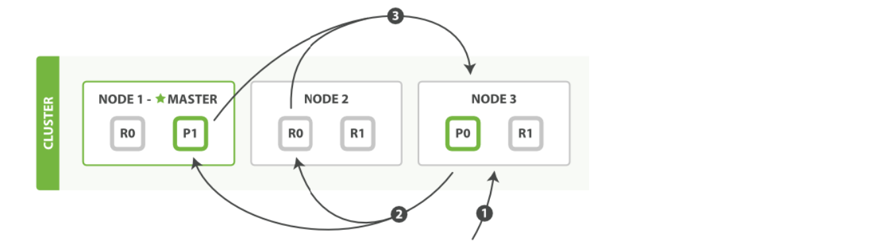
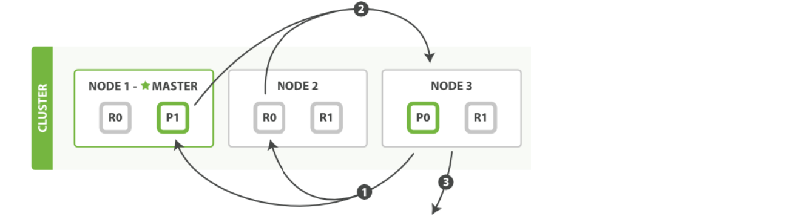

# ES检索原理

## 1.搜索文档（单个文档）

>1. 文档能够从主分片或任意一个复制分片被检索。

>2. 在主分片或复制分片上检索一个文档必要的顺序步骤：
>   - 客户端给Node 1 发送get请求。
>   - 节点使用文档的_id 确定文档属于分片0 。分片0 对应的复制分片在三个节点上都有。此时，它转发请求到Node 2 。
>   - Node 2 返回文档(document)给Node 1 然后返回给客户端。
>3. 对于读请求，为了平衡负载，请求节点会为每个请求选择不同的分片——它会循环所有分片副本。
>4. 可能的情况是，一个被索引的文档已经存在于主分片上却还没来得及同步到复制分片上。这时复制分片会报告文档未找到，主分片会成功返回文档。一旦索引请求成功返回给用户，文档则在主分片和复制分片都是可用的。

## 2.全文搜索

搜索，分为2个阶段，搜索（query）+取回（fetch）。

### 2.1.搜索（query）

>1. 查询阶段包含以下三步：
>   - 客户端发送一个search（搜索） 请求给Node 3 ,Node 3 创建了一个长度为from+size 的空优先级队
>   - Node3转发这个搜索请求到索引中每个分片的原本或副本。每个分片在本地执行这个查询并且结果将结果到一个大小为from+size 的有序本地优先队列里去。
>   - 每个分片返回document的ID和它优先队列里的所有document的排序值给协调节点Node3 。Node3 把这些值合并到自己的优先队列里产生全局排序结果。

### 2.2.取回（fetch）

>1. 分发阶段由以下步骤构成：
>   - 协调节点辨别出哪个document需要取回，并且向相关分片发出GET请求。
>   - 每个分片加载document并且根据需要丰富（enrich）它们，然后再将document返回协调节点。
>   - 一旦所有的document都被取回，协调节点会将结果返回给客户端。

## 3.读取数据流程

1. ##### 客户端发送请

   - 当用户想要从Elasticsearch中检索数据时，他们会通过Elasticsearch的客户端API发送一个搜索请求。这个请求包含了查询的详细信息，如要搜索的索引、查询类型（如匹配查询、范围查询等）、过滤条件等。

2. ##### 请求到达协调节点

   - 请求首先到达Elasticsearch集群中的一个节点，这个节点被称为协调节点（Coordinating Node）。协调节点负责接收客户端的请求，处理请求的路由逻辑，并与数据节点（Data Node）进行通信以获取实际的数据。

3. ##### 解析查询并确定目标分片

   - 协调节点接收到请求后，会解析查询语句，并根据索引的映射（Mapping）和设置（Settings）信息来确定需要查询哪些分片。Elasticsearch中的每个索引都被分割成多个分片，并且这些分片可以分布在集群的多个节点上以提高可扩展性和性能。

4. ##### 将请求转发给数据节点

   - 协调节点根据分片的位置信息将查询请求转发给包含目标分片的数据节点。每个数据节点上都存储着一部分索引的数据，并负责处理与这些数据相关的查询请求。

5. ##### 在数据节点上执行查询

   - 数据节点接收到查询请求后，会使用Lucene库来执行实际的搜索操作。Lucene是一个高性能、全功能的文本搜索引擎库，它提供了强大的索引和搜索功能。数据节点会根据查询条件在Lucene索引中检索匹配的文档，并生成一个结果集。

6. ##### 聚合和排序结果

   - 数据节点将查询结果返回给协调节点。如果查询涉及多个分片，协调节点需要聚合来自不同分片的结果，并根据需要对结果进行排序、分页等处理。这个过程可能需要消耗一定的计算资源，特别是当结果集很大时。

7. ##### 返回结果给客户端

   - 一旦结果准备好，协调节点会将它们封装成一个统一的响应格式，并返回给客户端。响应中包含了查询的结果、匹配的文档数量、聚合数据（如果有的话）等信息。客户端可以解析这个响应来获取所需的数据。

8. ##### 缓存和优化策略

   - **查询缓存**：Elasticsearch会对某些查询结果进行缓存，以便快速响应相同的查询请求。这可以减少对Lucene索引的重复访问，提高查询性能。然而，由于缓存空间有限，只有部分查询结果会被缓存。
   - **分片请求缓存**：数据节点上的分片请求缓存可以存储查询请求的结果。当相同的查询再次到达时，可以直接从缓存中获取结果，而无需再次访问Lucene索引。这有助于减少对磁盘I/O的依赖，提高查询速度。
   - **优化查询语句**：为了提高查询性能，用户应该编写高效的查询语句。避免使用高开销的查询操作（如通配符查询、正则表达式查询等），合理使用过滤器和聚合操作，以及优化索引结构都可以帮助提高查询速度。